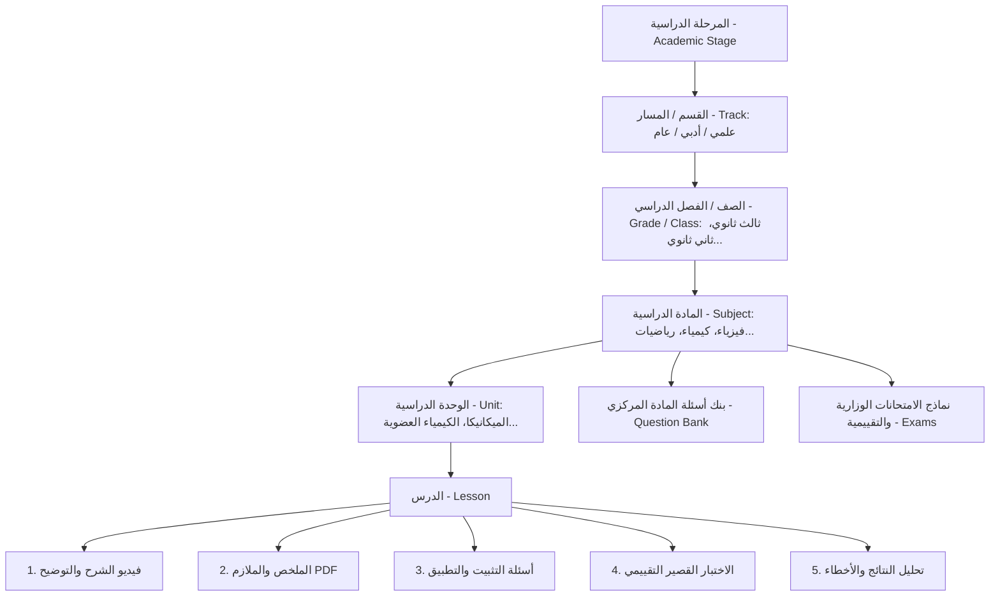

# 🧭 دليل ومواصفات بناء لوحة تحكم بوصلة الطالب (Student Compass Dashboard)
> **إصدار الوثيقة:** 1.0 — أغسطس 2026  
> **التقنية:** React 19 + TypeScript + Vite + Tailwind CSS + Shadcn UI + TanStack Query + React Router v7  
> **المرجع الهيكلي:** مستوحى ومطابق بنسبة 100% لهيكلية ومعايير مشروع `File-Archiving-and-Taxpayer-Services-System`.

---

## 📑 الفهرس العام
1. [نظرة عامة وأهداف النظام](#1-نظرة-عامة-وأهداف-النظام)
2. [المعمارية التقنية وحزم المكتبات (Tech Stack)](#2-المعمارية-التقنية-وحزم-المكتبات-tech-stack)
3. [هيكلية المجلدات والملفات (Project Structure)](#3-هيكلية-المجلدات-والملفات-project-structure)
4. [الهيكلية الأكاديمية والشجرية للمحتوى (Academic Hierarchy)](#4-الهيكلية-الأكاديمية-والشجرية-للمحتوى-academic-hierarchy)
5. [نظام الصلاحيات وتعدد الأدوار (RBAC & Permissions)](#5-نظام-الصلاحيات-وتعدد-الأدوار-rbac--permissions)
   - صلاحيات المدير العام (Super Admin)
   - صلاحيات المعلم / مشرف المادة (Teacher / Subject Supervisor)
   - ربط وتخصيص الطلاب بالفصول والمسارات (Student Class Allocation)
6. [وحدات وميزات لوحة التحكم (Dashboard Feature Modules)](#6-وحدات-وميزات-لوحة-التحكم-dashboard-feature-modules)
7. [شجرة المسارات والصفحات (Routing System)](#7-شجرة-المسارات-والصفحات-routing-system)
8. [نظام الاستيراد الجماعي للأسئلة (Bulk Import System - 50k+ Questions)](#8-نظام-الاستيراد-الجماعي-للأسئلة-bulk-import-system---50k-questions)
9. [طبقة واجهة برمجة التطبيقات والربط (API Layer & State Management)](#9-طبقة-واجهة-برمجة-التطبيقات-والربط-api-layer--state-management)
10. [نظام التصميم والمكونات (Design System & UI Components)](#10-نظام-التصميم-والمكونات-design-system--ui-components)
11. [خطة التنفيذ المرحلية (Implementation Roadmap)](#11-خطة-التنفيذ-المرحلية-implementation-roadmap)

---

## 1. نظرة عامة وأهداف النظام

لوحة تحكم **بوصلة الطالب (Student Compass Dashboard)** هي المنظومة الإدارية والتعليمية المركزية لإدارة كافة العمليات الأكاديمية لمنصة وتطبيق "بوصلة الطالب". تم تصميم اللوحة لتكون:
- **فائقة السرعة والأداء (High Performance):** قادرة على إدارة أكثر من 50,000 إلى 100,000+ سؤال، وآلاف الطلاب والمعلمين دون أي بطء في الواجهة.
- **عربية 100% وبدعم كامل للاتجاه من اليمين لليسار (RTL-First):** خطوط عربية فخمة (Almarai / IBM Plex Sans Arabic)، ألوان أكاديمية ملكية، ونظام Dark/Light متكامل.
- **تدرج هرمي أكاديمي محكم:** تحكم دقيق يبدأ من المراحل الدراسية، الأقسام (علمي / أدبي)، الفصول، المواد، الوحدات، الدروس، حتى أدق تفاصيل الأسئلة والاختبارات.
- **عزل صلاحيات المدرسين (Teacher Isolation):** تتيح للمعلم الدخول وإدارة مواده فقط، وإنشاء الأسئلة والاختبارات لطلابه دون التداخل مع بقية المواد.
- **تخصيص كامل للطالب (Student Scoping):** حصر الطالب في فصله ومساره التعليمي المخصص لتظهر له مواده واختباراته فقط في تطبيق الموبايل.

---

## 2. المعمارية التقنية وحزم المكتبات (Tech Stack)

مطابقة لمعمارية مشروع `File-Archiving-and-Taxpayer-Services-System`:

| المجال | المكتبة / التقنية | الإصدار | الغرض والاستخدام |
|---|---|---|---|
| **Core Framework** | React + TypeScript + Vite | React 19, TS ~5.9, Vite 7 | بناء واجهات سريعة ذات نمط أنواع قوي وتجميع لحظي |
| **Styling & Theme** | Tailwind CSS v4 + tw-animate | 4.x | تنسيق الواجهات مع الوضع الليلي (Dark Mode) و RTL |
| **UI Component Library** | Shadcn UI + Radix UI + Base UI | Latest | مكونات الجداول، النوافذ المنبثقة (Modals)، القوائم، والأزرار |
| **State & Server Cache** | TanStack Query v5 + Zustand | TanStack Query v5, Zustand 5 | إدارة الكاش، استرجاع بيانات الـ API، والـ Global Client State |
| **Routing** | React Router DOM | v7 | نظام توجيه المسارات، الحماية (Guards)، والمسارات المتداخلة |
| **Data Tables** | TanStack Table v8 | v8 | جداول متقدمة، ترقيم صفحات (Pagination)، فرز، وتصفية متقدمة |
| **Forms & Validation** | React Hook Form + Zod | Latest | نماذج معالجة البيانات والتحقق الصارم من المدخلات |
| **Charts & Analytics** | Recharts | Latest | لوحات التحليلات، نسب النجاح، ورسوم بيانية لأداء المواد والطلاب |
| **Icons & Fonts** | Lucide React + Fontsource (Almarai) | Latest | أيقونات حديثة وخط المراعي العربي الأصيل |
| **Notifications & Toast** | Sonner | Latest | تنبيهات وتأكيدات عمليات الحفظ والتعديل والحذف |
| **HTTP Client** | Axios Instance (Custom Interceptors) | Latest | معالجة التوكنات، تجديد الجلسات، واعتراض الأخطاء |

---

## 3. هيكلية المجلدات والملفات (Project Structure)

تنظيم المجلدات يتبع معمارية **Feature-Driven Architecture** المستندة للمشروع المرجعي:

```text
student-compass-dashboard/
├── public/
│   ├── favicon.ico
│   └── logos/
├── src/
│   ├── api/                          # إعدادات الـ Axios ومسارات الـ Endpoints المركزية
│   │   ├── client.ts                 # Axios Instance with Interceptors & Token Handling
│   │   └── endpoints.ts              # Constants for all backend API routes
│   │
│   ├── app/                          # النواة الأساسية للتطبيق
│   │   ├── App.tsx                   # الجذر وربط الـ Providers
│   │   ├── main.tsx                  # نقطة الانطلاق الرئيسية
│   │   ├── index.css                 # ثيم الألوان، الخطوط، ومتغيرات Tailwind v4
│   │   ├── providers/                # QueryClientProvider, ThemeProvider, DirectionProvider (RTL)
│   │   ├── router/                   # نظام المسارات والحماية
│   │   │   ├── index.tsx             # شجرة المسارات الرئيسية (Main Router Config)
│   │   │   ├── ProtectedRoute.tsx    # حماية المسارات والتحقق من التوكن
│   │   │   ├── RoleGuard.tsx         # حماية المسارات بناءً على الرتبة (Admin / Teacher)
│   │   │   └── PublicRoute.tsx       # صفحات الزوار (Login / Forgot Password)
│   │   └── store/                    # مخازن Zustand للحالة العامة
│   │       ├── authStore.ts          # بيانات المستخدم الحالي والتوكن والصلاحيات
│   │       ├── themeStore.ts         # الوضع الليلي والفاتح
│   │       └── academicScopeStore.ts # الفصل والمرحلة المختارة حالياً للفلترة
│   │
│   ├── components/                   # المكونات المشتركة المعاد استخدامها
│   │   ├── layout/                   # هيكل لوحة التحكم
│   │   │   ├── DashboardLayout.tsx   # التخطيط العام (Sidebar + Header + Content)
│   │   │   ├── DashboardHeader.tsx   # الشريط العلوي، الإشعارات، والملف الشخصي
│   │   │   ├── DashboardSideBar.tsx  # القائمة الجانبية التفاعلية المتكيفة مع الرتبة
│   │   │   └── PageHeader.tsx        # عنوان الصفحة ومسار التتبع (Breadcrumbs)
│   │   ├── ui/                       # مكتبة عناصر Shadcn UI (Button, Dialog, Input, Table, etc.)
│   │   ├── data-table/               # جداول البيانات المتقدمة مع التصفية والـ Pagination
│   │   ├── feedback/                 # شاشات التحميل (Skeletons)، رسائل الخطأ، والتأكيدات
│   │   └── file-upload/              # مكونات رفع الصور والملفات والـ PDFs مع المعاينة
│   │
│   ├── features/                     # ميزات ووحدات النظام المنفصلة (Feature-Driven)
│   │   ├── auth/                     # تسجيل الدخول واستعادة الحساب
│   │   ├── dashboard/                # لوحة الإحصائيات العامة والرئيسية
│   │   ├── academic-structure/       # إدارة المراحل والفصول والمسارات (علمي/أدبي)
│   │   ├── subjects/                 # إدارة المواد الدراسية وتعيين معلمي المواد
│   │   ├── curriculum/               # إدارة الوحدات والدروس ورحلة التعلم الـ 5 مراحل
│   │   ├── question-bank/            # بنك الأسئلة المركزي واستيراد الـ Excel/CSV
│   │   ├── exams/                    # إدارة الاختبارات الوزارية، التقييمية، والوحدات
│   │   ├── teachers/                 # إدارة حسابات المعلمين وربطهم بالمواد
│   │   ├── students/                 # إدارة الطلاب وتوزيعهم على الفصول والمسارات
│   │   ├── competitions/             # إدارة المسابقات التفاعلية ولوحة الشرف
│   │   ├── notifications/            # مركز إرسال الإشعارات والجدولة
│   │   ├── reports-analytics/        # تقارير الأداء، رسوم بيانية، ومراجعة أخطاء الطلاب
│   │   └── settings/                 # إعدادات النظام، النسخ الاحتياطي، والملف الشخصي
│   │
│   ├── hooks/                        # Custom React Hooks المشتركة (useDebounce, useRtl, etc.)
│   ├── lib/                          # أدوات مساعدة (clsx, tailwind-merge, date-fns, validators)
│   └── types/                        # تعريفات TypeScript العامة والمشتركة
│
├── components.json                   # Shadcn UI configuration
├── tailwind.config.ts / index.css    # إعدادات التصميم والمتغيرات اللونية
├── package.json
└── vite.config.ts
```

---

## 4. الهيكلية الأكاديمية والشجرية للمحتوى (Academic Hierarchy)

العمود الفقري للنظام يعتمد على تسلسل هرمي مرن وقابل للتوسع اللامحدود:



### العلاقات في قاعدة البيانات:
- **`academic_stages`**: المرحلة (مثلاً: المرحلة الثانوية، المرحلة الأساسية).
- **`tracks`**: القسم / الفرع (مثلاً: علمي، أدبي، عام).
- **`classrooms` / `grades`**: الصفوف (مثلاً: ثالث ثانوي علمي، ثالث ثانوي أدبي).
- **`subjects`**: ترتبط بالصف والقسم (`classroom_id`, `track_id`).
- **`units`**: ترتبط بالمادة (`subject_id`).
- **`lessons`**: ترتبط بالوحدة (`unit_id`).
- **`questions`**: ترتبط بالدرس أو الوحدة أو المادة مباشرة (`subject_id`, `unit_id`, `lesson_id`, `source`, `year`).
- **`exams`**: ترتبط بالمادة أو الوحدة أو شاملة على مستوى الوزارة (`exam_type`, `subject_id`, `year`).

---

## 5. نظام الصلاحيات وتعدد الأدوار (RBAC & Permissions)

### 1. المدير العام (Super Admin / Admin):
- يملك حق الوصول المطلق لكافة شاشات اللوحة.
- إدارة الهيكل التعليمي (المراحل، الأقسام، الفصول، المواد).
- إدارة حسابات المعلمين وتعيين المواد لكل معلم (`Assign Subjects`).
- إدارة شؤون الطلاب وتعيين كل طالب في فصله ومساره.
- الاطلاع على الإحصائيات الشاملة للمنصة ونتائج الامتحانات وسجلات النظام.
- إرسال الإشعارات العامة لجميع المستخدمين أو لفصول محددة.

### 2. المعلم / مشرف المادة (Teacher / Content Editor):
- **نظام العزل الذكي (Teacher Isolation):** عند تسجيل الدخول، يستعلم الـ API عن المواد المسندة للمعلم (`teacher_subjects`).
- اللوحة تعرض للمعلم **مواده فقط** في القائمة الجانبية والشاشات:
  - إضافة وتعديل وحذف الوحدات والدروس للمواد الخاصة به فقط.
  - رفع الفيديوهات والملخصات والـ PDFs التابعة لمواده.
  - إضافة الأسئلة يدوياً أو استيرادها جماعياً لمواده فقط.
  - إنشاء الاختبارات التقييمية ومسابقات المادة ومتابعة أداء الطلاب وحلولهم في مادته.
- لا يستطيع المعلم تعديل أو رؤية محتوى مواد المدرسين الآخرين ولا الوصول لإعدادات النظام العامة.

### 3. تخصيص الطالب (Student Scoping & Filtering):
- يتم ربط كل طالب بفصل محدد (`classroom_id` أو `grade_id` + `track_id`).
- في لوحة التحكم: يمكن للمسؤول فلترة الطلاب وتتبع إنجاز كل طالب داخل فصله.
- في تطبيق الموبايل والـ API: يتم تلقائياً تصفية المواد، الاختبارات، الخطط الدراسية، والمسابقات ليظهر للطالب فقط ما يخص مرحلته وفصله المسجل فيه.

---

## 6. وحدات وميزات لوحة التحكم (Dashboard Feature Modules)

### 🏢 وحدة 1: لوحة الإحصائيات العامة (Dashboard Analytics)
- **بطاقات المؤشرات الرئيسية (KPI Cards):**
  - إجمالي الطلاب النشطين، إجمالي المعلمين، إجمالي المواد، إجمالي بنك الأسئلة (50,000+).
- **الرسوم البيانية التفاعلية (Recharts):**
  - رسم بياني لمعدلات اجتياز الاختبارات وتوزيع درجات الطلاب.
  - رسم بياني للأسئلة المنجزة يومياً ونشاط الطلاب الأسبوعي.
  - نسبة اكتمال المناهج والدروس لكل مادة.
- **جدول أحدث النشاطات:** الامتحانات المقدمة حديثاً، أحدث الأسئلة المضافة، وطلبات التعديل.

---

### 🏫 وحدة 2: الهيكل التعليمي والمراحل (Academic Structure)
- **إدارة المراحل (Stages):** إضافة المرحلة (الاسم، الوصف، الحالة).
- **إدارة الأقسام والمسارات (Tracks):** (علمي، أدبي، عام).
- **إدارة الفصول والصفوف (Classrooms / Grades):** ربط الفصل بالمرحلة والمسار وتحديد العام الدراسي الحالي.
- **شجرة المنهج التفاعلية (Curriculum Tree View):** استعراض بصري شجري سريع للتنقل بين المرحلة ← المسار ← الفصل ← المادة.

---

### 📚 وحدة 3: إدارة المواد والمعلمين (Subjects & Teacher Assignment)
- **إدارة المواد:** (اسم المادة، الكود، الأيقونة/الصورة، اللون التعريفي، الفصل التابع له، الترتيب).
- **مودال تعيين المعلمين (Assign Teachers Modal):**
  - تحديد معلم أو أكثر للمادة الواحدة مع تحديد الصلاحيات (محرر كامل، مشاهد فقط).
  - عرض قائمة بالمعلمين المسؤولين عن كل مادة مع أزرار الإضافة والإلغاء السريع.

---

### 📖 وحدة 4: إدارة الوحدات والدروس ورحلة التعلم (Curriculum & Lessons)
- **إدارة الوحدات (Units):** (عنوان الوحدة، رقم الوحدة، وصفها، أهدافها التعليمية).
- **إدارة الدروس (Lessons):**
  - محرر الدرس المتكامل (Lesson Editor):
    - **المرحلة 1 - الشرح (Explanation):** رابط فيديو (YouTube / Vimeo / Cloud Storage)، مدة الفيديو، نقاط الشرح الأساسية.
    - **المرحلة 2 - الملخص (Summary & PDFs):** رفع ملف PDF الملخص، محتوى نصي غني (Rich Text)، صور الملاحظات الذهنية.
    - **المرحلة 3 - أسئلة التثبيت (Practice Bank):** ربط أسئلة تثبيت فورية مع شروحات الحل.
    - **المرحلة 4 - الاختبار القصير (Quiz):** إنشاء كويز سريع من 5-10 أسئلة لحساب درجة إتقان الدرس.
    - **المرحلة 5 - تحليل الأداء:** مراجعة الأسئلة التي يكثر خطأ الطلاب فيها في هذا الدرس.

---

### 🎯 وحدة 5: بنك الأسئلة المركزي المتقدم (Centralized Question Bank)
- **محرك إدارة الأسئلة الضخم (50,000+ Questions Engine):**
  - استعراض الأسئلة في جدول عالي الأداء يدعم البحث الفوري اللحظي (Debounced Search)، والفلترة المتعددة حسب: (المادة، الوحدة، الدرس، السنة الوزارية، جهة المصدر، مستوى الصعوبة: سهل/متوسط/صعب).
- **محرر السؤال المتقدم (Question Builder):**
  - نص السؤال (يدعم المعادلات الرياضية والصيغ العلمية).
  - إرفاق صورة/مخطط للسؤال إن وجد.
  - الخيارات الأربعة (أ، ب، ج، د) أو خيارات الصواب والخطأ.
  - تحديد الإجابة الصحيحة.
  - كتابة **تفسير وشرح الإجابة المفصل (Answer Explanation)** ليتعلم منه الطالب عند الخطأ.
  - وسم السؤال بالمصدر (وزاري 2024، وزاري 2023، بنك التميز، تجريبي).
- **نظام الاستيراد الجماعي الذكي (Excel / CSV Bulk Import):** (مشروح بالتفصيل في القسم 8).

---

### 📝 وحدة 6: إدارة الاختبارات والتقييمات (Exams Management)
- **أنواع الاختبارات:**
  1. **اختبارات وزارية رسمية (Ministerial Exams):** مخصصة حسب السنة والمادة مع مؤقت زمني دقيق.
  2. **اختبارات تقييمية وشاملة (Assessment Exams):** تشمل عدة وحدات أو المنهج كاملاً.
  3. **اختبارات الوحدات والدروس (Unit/Lesson Quizzes):** تقييم مرحلي مباشر.
- **منشئ الاختبارات التفاعلي (Exam Builder):**
  - اختيار الأسئلة يدوياً من بنك الأسئلة أو توليد تلقائي عشوائي بناءً على معايير محددة (مثلاً: 30 سؤال: 10 سهل، 15 متوسط، 5 صعب).
  - تحديد الوقت بالدقائق، درجة النجاح، عدد المحاولات المسموحة، وتعليمات الاختبار.
  - تبديل ترتيب الأسئلة والخيارات عشوائياً لكل طالب (Randomization).

---

### 👨‍🏫 وحدة 7: إدارة المعلمين والمشرفين (Teachers Management)
- إضافة حساب معلم جديد (الاسم، البريد، الهاتف، كلمة المرور، التخصص).
- جدول المعلمين مع عرض عدد المواد المسندة لكل معلم وعدد الأسئلة والدروس التي أنشأها.
- سجل نشاطات وتعديلات المعلمين.
- تفعيل / تجميد الحسابات.

---

### 👨‍🎓 وحدة 8: إدارة الطلاب والمتابعة الأكاديمية (Students Management)
- دليل الطلاب مع التصفية بالفصل الدراسي، المسار (علمي/أدبي)، وحالة الحساب.
- **الملف الأكاديمي للطالب (Student Dossier):**
  - عرض نسبة إنجاز المواد، عدد الدروس المكتملة، وعدد الاختبارات المجتازة.
  - سجل نتائج الاختبارات ودرجات الطالب بالتفصيل.
  - شاشة تحليل نقاط الضعف والأسئلة الأكثر خطأً للطالب.
  - إعادة تعيين كلمة المرور أو تعديل الفصل الدراسي للطالب.

---

### 🏆 وحدة 9: المسابقات ولوحة الشرف (Competitions & Leaderboards)
- إنشاء وإدارة المسابقات التنافسية (تاريخ البدء، تاريخ الانتهاء، عدد الأسئلة، النقاط المكتسبة، المادة المستهدفة).
- متابعة لوحة الشرف المباشرة (Live Leaderboard): عرض المراكز الأولى (المركز الأول، الثاني، الثالث) وإحصائيات المشاركين.

---

### 🔔 وحدة 10: مركز الإشعارات والرسائل التفاعلية (Notification Center)
- إرسال إشعار فوري أو مجدول (تذكير مذاكرة، إعلان امتحان وزاري، مسابقة جديدة، إعلان عام).
- تحديد الفئة المستهدفة: (جميع الطلاب، طلاب صف معين، طلاب مسار محدد، أو مستخدمين محددين).
- سجل الإشعارات المرسلة مع نسبة الفتح والتفاعل.

---

### ⚙️ وحدة 11: إعدادات النظام والأمان والنسخ الاحتياطي (System Settings & Backup)
- إدارة الملف الشخصي وتغيير كلمة المرور للمدراء والمدرسين.
- إعدادات منصة التخزين والملفات والـ PDFs ومفاتيح الـ APIs.
- نظام النسخ الاحتياطي لقاعدة البيانات وبنك الأسئلة (One-Click Backup & Export).
- سجل العمليات والتدقيق الأمني (Audit Logs).

---

## 7. شجرة المسارات والصفحات (Routing System)

مبنية وفق أحدث معايير React Router v7 مع حماية المسارات (Route Guards):

```tsx
// src/app/router/index.tsx
export const router = createBrowserRouter([
  // مسارات المصادقة العامة (Public Routes)
  {
    element: <PublicRoute />,
    children: [
      { path: "/login", element: <LoginPage /> },
      { path: "/forgot-password", element: <ForgotPasswordPage /> },
      { path: "/reset-password", element: <ResetPasswordPage /> },
    ],
  },

  // مسارات لوحة التحكم المحمية (Protected Dashboard Routes)
  {
    path: "/",
    element: <ProtectedRoute><DashboardLayout /></ProtectedRoute>,
    children: [
      // 1. الرئيسية والإحصائيات
      { index: true, element: <DashboardOverviewPage /> },

      // 2. الهيكل التعليمي والمراحل (خاص بالمدير العام)
      {
        path: "academic-structure",
        element: <RoleGuard allowedRoles={["admin"]} />,
        children: [
          { index: true, element: <AcademicStagesPage /> },
          { path: "tracks", element: <TracksPage /> },
          { path: "classrooms", element: <ClassroomsPage /> },
        ],
      },

      // 3. إدارة المواد (المشرف والمدير)
      {
        path: "subjects",
        children: [
          { index: true, element: <SubjectsListPage /> },
          { path: ":subjectId", element: <SubjectDetailsPage /> },
          { path: ":subjectId/curriculum", element: <CurriculumEditorPage /> },
          { path: ":subjectId/units/:unitId/lessons/:lessonId", element: <LessonEditorPage /> },
        ],
      },

      // 4. بنك الأسئلة المركزي
      {
        path: "question-bank",
        children: [
          { index: true, element: <QuestionBankListPage /> },
          { path: "create", element: <QuestionCreatePage /> },
          { path: "edit/:questionId", element: <QuestionEditPage /> },
          { path: "bulk-import", element: <QuestionBulkImportPage /> },
        ],
      },

      // 5. إدارة الاختبارات
      {
        path: "exams",
        children: [
          { index: true, element: <ExamsListPage /> },
          { path: "create", element: <ExamBuilderPage /> },
          { path: "edit/:examId", element: <ExamBuilderPage /> },
          { path: ":examId/results", element: <ExamResultsAnalyticsPage /> },
        ],
      },

      // 6. إدارة المعلمين (خاص بالمدير العام)
      {
        path: "teachers",
        element: <RoleGuard allowedRoles={["admin"]} />,
        children: [
          { index: true, element: <TeachersListPage /> },
          { path: ":teacherId", element: <TeacherDetailsPage /> },
          { path: ":teacherId/assign-subjects", element: <AssignSubjectsPage /> },
        ],
      },

      // 7. إدارة الطلاب
      {
        path: "students",
        children: [
          { index: true, element: <StudentsListPage /> },
          { path: ":studentId", element: <StudentProfileDossierPage /> },
          { path: ":studentId/performance", element: <StudentPerformancePage /> },
        ],
      },

      // 8. المسابقات ولوحة الشرف
      {
        path: "competitions",
        children: [
          { index: true, element: <CompetitionsListPage /> },
          { path: "create", element: <CompetitionBuilderPage /> },
          { path: ":competitionId/leaderboard", element: <LeaderboardManagerPage /> },
        ],
      },

      // 9. مركز الإشعارات
      {
        path: "notifications",
        children: [
          { index: true, element: <NotificationsManagerPage /> },
          { path: "create", element: <CreateNotificationPage /> },
        ],
      },

      // 10. التقارير والتحليلات
      {
        path: "reports",
        element: <ReportsAnalyticsPage />,
      },

      // 11. الإعدادات
      {
        path: "settings",
        element: <SettingsLayout />,
        children: [
          { index: true, element: <ProfileSettingsPage /> },
          { path: "system", element: <RoleGuard allowedRoles={["admin"]}><SystemSettingsPage /></RoleGuard> },
          { path: "backups", element: <RoleGuard allowedRoles={["admin"]}><BackupsManagerPage /></RoleGuard> },
        ],
      },
    ],
  },

  // مسار 404
  { path: "*", element: <NotFoundPage /> },
]);
```

---

## 8. نظام الاستيراد الجماعي للأسئلة (Bulk Import System - 50k+ Questions)

نظراً لأهمية بنك الأسئلة (أكثر من 50,000 سؤال وزاري وتقييمي)، تم تصميم مسار عمل استيراد ذكي من 5 مراحل صارمة لمنع الأخطاء وضمان جودة البيانات:

```text
[1. رفع الملف Excel/CSV] 
       ↓
[2. المعاينة المباشرة وتفكيك البيانات (Data Parsing & Preview)] 
       ↓
[3. الفحص والتحقق الصارم (Validation Engine)] 
       ↓
[4. كشف وحصر الأسئلة المكررة (Duplicate Detection)] 
       ↓
[5. المراجعة والتعديل اللحظي قبل الاستيراد] 
       ↓
[6. الاعتماد والاستيراد النهائي بقاعدة البيانات (Batch Insert)]
```

### متطلبات شاشة الاستيراد:
1. **تحميل القالب الثابت (Download Fixed Template):** زر لتحميل قالب Excel/CSV قياسي جاهز يحتوي على الأعمدة:
   `[Subject, Unit, Lesson, Year, Source, QuestionText, OptionA, OptionB, OptionC, OptionD, CorrectAnswer, Explanation, Difficulty]`.
2. **شريط مؤشرات الفحص الإحصائي:**
   - إجمالي الأسئلة المرفوعة (مثلاً: 5,000).
   - الأسئلة السليمة الجاهزة للاستيراد (مثلاً: 4,820).
   - أسئلة بها حقول ناقصة أو أخطاء (مثلاً: 130).
   - أسئلة مكررة مكتشفة (مثلاً: 50).
3. **جدول المراجعة التفاعلي (Interactive Review Table):** إمكانية تعديل أي حقل به خطأ مباشرة من الجدول بالضغط عليه دون الحاجة لإعادة رفع الملف من الصفر.
4. **شريط التقدم أثناء الحفظ (Progress Bar with Chunking):** إرسال البيانات للباك إند على دفعات (Chunks of 500 questions) لتفادي انقطاع الاتصال أو تجاوز حدود الذاكرة.

---

## 9. طبقة واجهة برمجة التطبيقات والربط (API Layer & State Management)

### Axios Instance مع Interceptors الذكية:
- إضافة `Authorization: Bearer <token>` تلقائياً في كل طلب.
- معالجة أخطاء `401 Unauthorized` وتوجيه المستخدم لتسجيل الدخول بأمان.
- توحيد معالجة رسائل الخطأ وعرض تنبيهات عبر `Sonner Toasts`.

### إدارة الكاش عبر TanStack Query:
- استخدام Query Keys موحدة ومنظمة مثل:
  - `['subjects', { classroomId, trackId }]`
  - `['questions', { subjectId, unitId, page, search }]`
  - `['teachers']`
  - `['students', { classroomId, page }]`
- استخدام `useMutation` مع `queryClient.invalidateQueries` للتحديث التلقائي الفوري للجداول عند الإضافة أو التعديل أو الحذف دون إعادة تحميل الصفحة.

---

## 10. نظام التصميم والمكونات (Design System & UI Components)

### لوحة الألوان (Color Palette):
- **اللون الأساسي الأكاديمي (Primary Blue):**
  - Dark Blue: `#1E3A8A` (أزرق ملكي داكن للبانرات والـ Sidebar).
  - Royal Blue: `#2563EB` (أزرق تفاعلي للأزرار وحالات التحديد).
  - Light Accent: `#EFF6FF` (خلفيات الكروت النشطة).
- **ألوان الحالة (Status Colors):**
  - النجاح: `#10B981` (Emerald).
  - التحذير: `#F59E0B` (Amber).
  - الخطأ والحذف: `#EF4444` (Rose).
- **الوضع الليلي (Dark Mode):** ألوان رمادية عميقة مريحة للعين (`#0F172A`, `#1E293B`) متناسقة مع الهوية.

### الخطوط والطباعة (Typography):
- استخدام خط **Almarai** و **IBM Plex Sans Arabic** للعناوين والنصوص.
- أحجام نصوص واضحة ومتباينة تدعم التصفح السريع والمريح.

---

## 11. خطة التنفيذ المرحلية (Implementation Roadmap)

| المرحلة | الأهداف والمخرجات | المدة المتوقعة |
|---|---|:---:|
| **المرحلة 1: التأسيس والبنية التحتية** | • تثبيت الحزم وإعداد Tailwind v4 + Shadcn UI + RTL<br>• إعداد Axios Client + TanStack Query + Zustand Store<br>• بناء الـ DashboardLayout والـ Header والـ Sidebar | 🟢 **الخطوة الأولى** |
| **المرحلة 2: المصادقة وحماية المسارات** | • شاشات تسجيل الدخول واستعادة الحساب<br>• الـ Protected Routes والـ Role Guards (Admin / Teacher) | 🟢 **الخطوة الثانية** |
| **المرحلة 3: الهيكل التعليمي والمواد** | • شاشات المراحل، المسارات، والصفوف<br>• إدارة المواد وتعيين المعلمين للمواد | 🟢 **الخطوة الثالثة** |
| **المرحلة 4: المناهج ورحلة التعلم الـ 5 مراحل** | • إدارة الوحدات والدروس<br>• محرر الدرس (فيديو، PDF، تثبيت، كويز) | 🟢 **الخطوة الرابعة** |
| **المرحلة 5: بنك الأسئلة ونظام الاستيراد الضخم** | • جدول بنك الأسئلة المتقدم مع التصفية اللحظية<br>• محرك استيراد Excel/CSV الذكي مع الفحص وكشف التكرار | 🟢 **الخطوة الخامسة** |
| **المرحلة 6: الاختبارات والمسابقات** | • منشئ الاختبارات الوزارية والتقييمية (Exam Builder)<br>• إدارة المسابقات ولوحة المتصدرين | 🟢 **الخطوة السادسة** |
| **المرحلة 7: إدارة المعلمين والطلاب** | • شاشات المعلمين والطلاب وتخصيص الفصول<br>• سجلات الأداء ومتابعة نتائج الطلاب | 🟢 **الخطوة السابعة** |
| **المرحلة 8: الإشعارات، التقارير، والتشطيب** | • مركز الإشعارات والتحليلات والرسوم البيانية<br>• النسخ الاحتياطي واختبارات الأداء والتسليم النهائي | 🟢 **الخطوة الثامنة** |

---
**جاهز للتنفيذ الفوري بالبناء خطوة بخطوة وفق هذه المعايير.**
